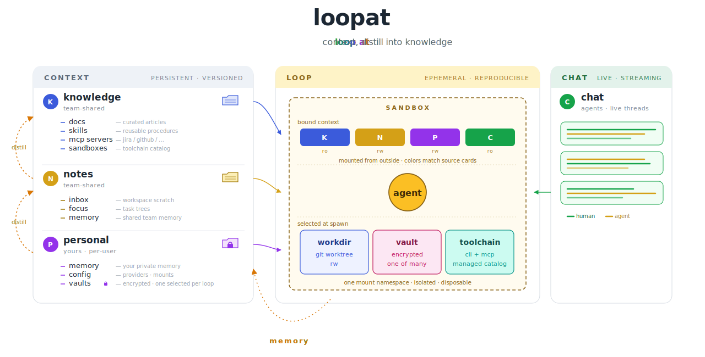

# loopat

> **Self-hosted AI collaboration workspace built around context management**
> — your data, your keys, git-based, multi-user.
>
> *loop at context, distill into knowledge.*

When humans collaborate with AI, three things only humans can bring:

- **Drive** — what work to start, what's worth doing next
- **Attention** — what matters right now, what to ignore
- **Entropy reduction** — turning noise into structured knowledge

loopat is built around managing these three as first-class concepts:
**Loop** (drive) · **Focus** (attention) · **Context** (entropy
reduction). A fourth concept — **Chat** — coordinates the team on the
sync axis.

<p align="center">
  
</p>

The agent itself is the [Claude Agent SDK][sdk] — what makes loopat
distinct is the **context architecture around it**. Every loop is a
persistent, sandboxed session with its own credential vault and a
slice of shared team knowledge. Teams share tools and knowledge;
members keep their own credentials and identity.

[sdk]: https://github.com/anthropics/claude-agent-sdk

⭐ [Star on GitHub](https://github.com/simpx/loopat) ·
🚀 [Quick start](#quick-start) ·
📖 [Architecture](docs/architecture.md)

<!-- TODO: add docs/screenshot.png — a single product screenshot showing
     a loop view with chat on one side and workdir/git on the other. -->

---

## What makes loopat different

- **End-to-end context management.** Chat history, code edits, agent
  decisions, memory — all live in the same context graph and all flow
  into the next loop. Most tools treat the conversation as ephemeral
  and only persist files; loopat treats **chat itself** as a first-class
  context artifact.
- **Reproducible loops.** Every loop runs in a bwrap sandbox with a
  pinned toolchain (mise) and a pinned credential vault. Spawn the same
  loop tomorrow on a different machine and get the same starting state.
  No "works on my machine" for AI sessions.
- **Built for teams, not just individuals.** Shared `knowledge/` and
  `notes/` git repos sync across members; loops contribute back via
  auto-commit and distillation. Almost every AI coding tool today is
  built for a solo dev — loopat is built for a team working on the same
  codebase together.
- **Self-hosted, data you own.** BYO API key, per-vault credential
  isolation, everything lives in local git repos. Nothing leaves your
  machine except the model API call itself.

## How loopat compares

| | Claude Code | opencode | Codex | **loopat** |
|---|---|---|---|---|
| Form factor | CLI | TUI | Web (hosted) | **Web (self-hosted)** |
| Data location | local files | local files | OpenAI servers | **local git repos** |
| API key | BYO | BYO | OpenAI account | **BYO + per-vault isolation** |
| Multi-user | ❌ | ❌ | account-based | **shared workspace** |
| Sandbox isolation | process-level | process-level | OpenAI-managed | **bwrap (lightweight, default) · Docker (planned)** |
| Context layers | `CLAUDE.md` | `AGENTS.md` | in-session | **doctrine + team + project + memory** |
| Memory management | personal (`CLAUDE.md`) | personal (`AGENTS.md`) | none | **personal + team-shared, auto distillation between layers** |
| Credential storage | env vars | env vars | platform-managed | **filesystem vault overlay** |
| Parallel sessions | many terminals | many terminals | tabs | **loops as first-class objects** |
| Agent engine | proprietary | pluggable | proprietary | **Claude Agent SDK** |

---

## Quick start

```sh
git clone https://github.com/simpx/loopat.git
cd loopat && bun install
bun run dev
```

Open <http://localhost:7787>. The first run bootstraps `~/.loopat/`,
prints a checklist, and prompts you to set your API key in
`~/.loopat/config.json`. Restart — done.

> **Needs:** Linux + [bubblewrap][bwrap] + [mise][mise] + [bun][bun] on
> the host. macOS / Windows is via Docker (see below). For team setups
> with shared knowledge/notes git repos and full bootstrap details, see
> the [installation guide](docs/install.md).

[bwrap]: https://github.com/containers/bubblewrap
[mise]: https://mise.jdx.dev/
[bun]: https://bun.sh/

## Deployment

### Docker (easiest, cross-platform)

```sh
docker compose up -d
```

Exposes `17787:7787`, persists the workspace in the `loopat-data` volume.
Needs `SYS_ADMIN` + unconfined AppArmor for bwrap mount namespaces — see
[`docker-compose.yml`](docker-compose.yml).

### From source (Linux)

```sh
cd web && bun run build           # → web/dist/
PORT=7787 bun run server/src/index.ts
```

Single Hono process serves API + static SPA + websocket on one port.
Put a reverse proxy in front and proxy `/api` + `/ws` to the server.

## Documentation

- **[Architecture](docs/architecture.md)** — the read/write path, layered
  context model, distillation pipeline, philosophy.
- **[Sandbox](docs/sandbox.md)** — bwrap mount mechanics, three-tier mount
  authority, what stops the agent from escaping.
- **[Installation guide](docs/install.md)** — full bootstrap, team setup,
  environment variables.
- **[Troubleshooting](docs/troubleshoot.md)** — chat won't start, banner
  errors, common pitfalls.
- **[Claude config](docs/claude-config.md)** — how the L1/L2/L3
  `CLAUDE.md` layers compose per turn.

## Contributing

Issues and PRs welcome. Before opening a non-trivial PR, please skim
[`docs/architecture.md`](docs/architecture.md) so the change lands in the
right layer (sandbox / vault / loop / chat).

Contributors are asked to sign the [Contributor License Agreement](CLA.md)
on their first PR — the [CLA Assistant][cla-assistant] bot prompts you
with a one-click link. This grants the project the right to relicense in
the future (e.g. for a hosted commercial offering) without re-collecting
permission from every contributor.

[cla-assistant]: https://cla-assistant.io/

## Acknowledgments

loopat is built on top of:

- [Claude Agent SDK][sdk] — the agent runtime
- [assistant-ui](https://github.com/assistant-ui/assistant-ui) — React
  components for the chat interface
- [Hono](https://hono.dev/) — the HTTP + WebSocket server
- [bubblewrap](https://github.com/containers/bubblewrap) — sandbox mount
  namespaces

## License

[Apache License 2.0](LICENSE). See [`NOTICE`](NOTICE) for required
attributions and [`CLA.md`](CLA.md) for contribution terms.
