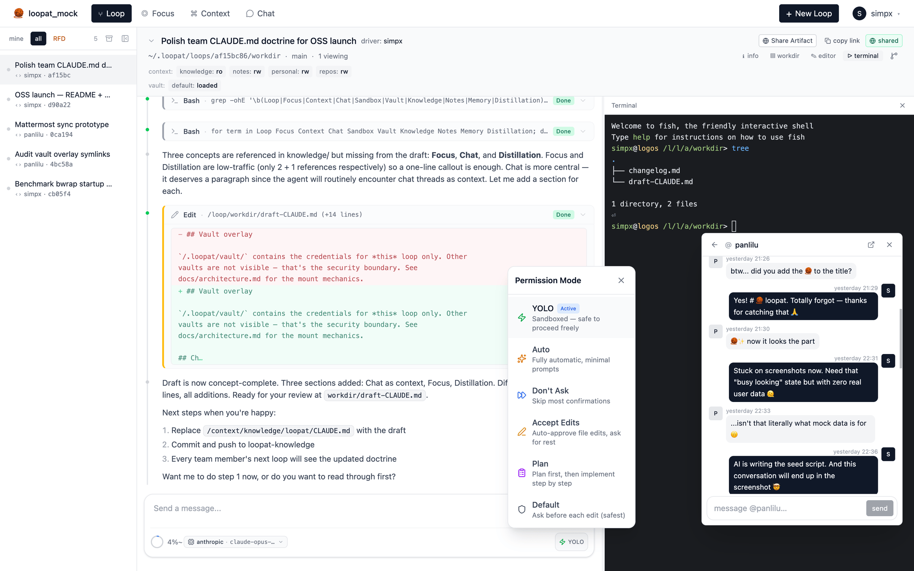

# 🧶 loopat

> **Self-hosted AI workspace built around context management — works solo, scales to teams**

<p align="center">
  
</p>

⭐ [Star on GitHub](https://github.com/simpx/loopat) ·
🚀 [Quick start](#quick-start) ·
📖 [Architecture](docs/architecture.md)

---

When humans collaborate with AI, three things only humans can bring:

- **Drive** — pushing the work forward. AI has no desires, no
  ambition of its own; momentum has to come from a human.
- **Attention** — what matters now, what to ignore. AI doesn't know
  what's worth your time.
- **Entropy reduction** — turning noise into structured knowledge.
  AI generates tokens but won't spontaneously simplify.

loopat is built around managing these three as first-class concepts:
**Loop** (drive) · **Focus** (attention) · **Context** (entropy
reduction). A fourth concept — **Chat** — coordinates the team on the
sync axis.

<p align="center">
  
</p>

The agent itself is the [Claude Agent SDK][sdk]; what makes loopat
distinct is the **context architecture around it** — how chat, code,
memory, and knowledge interlock so context doesn't get lost across
sessions or teammates.

[sdk]: https://github.com/anthropics/claude-agent-sdk

---

## What makes loopat different

- **End-to-end context management.** Team chat (IM) threads, code
  edits, agent decisions, memory — all live in the same context graph
  and all flow into the next loop. Most AI tools make you copy-paste
  from Slack into the AI to give it situational context; loopat treats
  team chat as **a first-class context source** — spawn a loop from
  any chat thread and that thread becomes part of the loop's context
  automatically.
- **Works solo, scales to teams.** Same workspace whether you're
  alone or onboarding teammates. Solo, it's a personal AI workspace;
  with a team, shared `knowledge/` and `notes/` git repos sync across
  members, loops auto-commit their work, and observations promote
  upward through a distillation pipeline. Most AI tools force you to
  pick between solo CLI and team SaaS — loopat is one tool at any scale.
- **Reproducible loops.** Every loop runs in its own sandbox with a
  versioned toolchain and a pinned credential vault. Spawn the same
  loop tomorrow on a different machine and get the same starting
  state. No "works on my machine" for AI sessions.
- **Self-hosted, data you own.** All artifacts live in plain git
  repos you fully control; vault secrets are git-crypt encrypted.
  BYO API key — nothing leaves your machine except the model API call
  itself.

## How loopat compares

| | Claude Code | Cursor | opencode | Codex | **loopat** |
|---|---|---|---|---|---|
| Form factor | CLI | IDE | TUI | Web (hosted) | **Web (self-hosted)** |
| License | proprietary | proprietary | MIT | proprietary | **Apache 2.0** |
| Team IM integration | external (manual paste) | external (manual paste) | external (manual paste) | external (manual paste) | **built-in, threads ingested into loop context** |
| Memory management | personal (`CLAUDE.md`) | personal (rules + memories) | personal (`AGENTS.md`) | none | **personal + team-shared, with distillation pipeline** |
| Multi-user | single user | per-seat | single user | per-account | **shared workspace** |
| Shared team knowledge | individual config | individual config | individual config | individual config | **git-synced across team** |
| Per-session sandbox | process-level | process-level | process-level | OpenAI-managed | **bwrap (default) · Docker (planned)** |
| Toolchain pinning | host runtime | host runtime | host runtime | fixed (hosted env) | **per-loop versioned** |
| Per-task credential isolation | shared (env vars) | shared (subscription) | shared (env vars) | account-managed | **per-loop vault overlay** |
| Data location | local files | cloud | local files | OpenAI servers | **git repos you control** |
| Secrets storage | env vars (plaintext) | cloud-managed | env vars (plaintext) | platform-managed | **git-crypt encrypted vault** |
| Agent engine | proprietary (Anthropic) | proprietary (multi-model) | pluggable | proprietary (OpenAI) | **Claude Agent SDK** |

---

## Quick start

```sh
npx loopat
```

Open <http://localhost:10001>. The first run bootstraps `~/.loopat/`,
prints a checklist, and prompts you to set your API key in
`~/.loopat/config.json`. Restart — done.

> **Needs:** [Node][node] to launch — the [Bun][bun] runtime is fetched
> automatically, so you don't install it yourself. The terminal / chat
> sandbox additionally needs a Linux host with [podman][podman]. Change
> the port with `PORT=8080 npx loopat`. macOS / Windows is via Docker
> (see below).

### From source (for development)

```sh
git clone https://github.com/simpx/loopat.git
cd loopat && bun install
bun run dev
```

> Needs [bun][bun] + [bubblewrap][bwrap] + [mise][mise] on the host. For
> team setups with shared knowledge/notes git repos and full bootstrap
> details, see the [installation guide](docs/install.md).

### Setup guides

Loopat splits configuration along role lines — read whichever applies:

- **[Admin setup](docs/setup-admin.md)** — provision the workspace:
  knowledge / notes repos, team sandboxes, MCP, operator mounts. Run
  this once per workspace.
- **[User setup](docs/setup-user.md)** — join an existing workspace:
  personal credential repo, providers, vaults, sandbox mounts. Run
  this once per member, per machine.

[bwrap]: https://github.com/containers/bubblewrap
[mise]: https://mise.jdx.dev/
[bun]: https://bun.sh/
[node]: https://nodejs.org/
[podman]: https://podman.io/

## Deployment

### Docker (recommended)

Pull the prebuilt image from GHCR:

```sh
docker run -d --privileged -p 20001:10001 ghcr.io/simpx/loopat:latest
```

Or, to build from source and persist the workspace in a named volume:

```sh
docker compose up -d
```

Open <http://localhost:20001> (note: **20001**, not 10001 — the host
port is remapped to avoid collision with a local dev server; see
[`docker-compose.yml`](docker-compose.yml)). Workspace persists in
the `loopat-data` volume. Needs `SYS_ADMIN` + unconfined AppArmor for
bwrap mount namespaces.

### From source (Linux)

```sh
bun run build                     # installs deps + builds frontend → web/dist/
PORT=10001 bun run server/src/index.ts
```

Single Hono process serves API + static SPA + websocket on one port.
Put a reverse proxy in front and proxy `/api` + `/ws` to the server.

## Documentation

- **[Admin setup](docs/setup-admin.md)** — workspace config, knowledge /
  notes repos, sandboxes, MCP, operator mounts.
- **[User setup](docs/setup-user.md)** — personal repo, providers,
  vaults, sandbox mounts.
- **[Installation guide](docs/install.md)** — host install, system deps,
  environment variables.
- **[Architecture](docs/architecture.md)** — the read/write path, layered
  context model, distillation pipeline, Claude config injection paths.
- **[Context flow](docs/context-flow.md)** — the horizontal working model: a
  loop is a git worktree, shared context is `main`, and loops exchange it over
  two edges — pull and promote.
- **[Identity](docs/identity.md)** — who a loop acts as: the credential chain
  (deploy key → git-crypt → vault), and how loopat integrates with your git
  host so onboarding is one authorization.
- **[.claude composition](docs/composition.md)** — how team / profile /
  personal / repo `.claude/` tiers merge into the loop runtime, and what
  you can put in each tier.
- **[Sandbox](docs/sandbox.md)** — bwrap mount mechanics, three-tier mount
  authority, what stops the agent from escaping.
- **[Troubleshooting](docs/troubleshoot.md)** — chat won't start, banner
  errors, common pitfalls.

## Contributing

Issues and PRs welcome. Before opening a non-trivial PR, please skim
[`docs/architecture.md`](docs/architecture.md) so the change lands in the
right layer (sandbox / vault / loop / chat).

Contributors are asked to sign the [Contributor License Agreement](CLA.md)
on their first PR — the [CLA Assistant][cla-assistant] bot prompts you
with a one-click link. This keeps future licensing options open (e.g.
moving to a business-friendly license) without having to re-collect
permission from every contributor.

[cla-assistant]: https://cla-assistant.io/

## Acknowledgments

loopat is built on top of:

- [Claude Agent SDK][sdk] — the agent runtime
- [assistant-ui](https://github.com/assistant-ui/assistant-ui) — React
  components for the chat interface
- [Hono](https://hono.dev/) — the HTTP + WebSocket server
- [bubblewrap](https://github.com/containers/bubblewrap) — sandbox mount
  namespaces
- [mise](https://mise.jdx.dev/) — per-loop toolchain installs

## License

[Apache License 2.0](LICENSE). See [`NOTICE`](NOTICE) for required
attributions and [`CLA.md`](CLA.md) for contribution terms.
