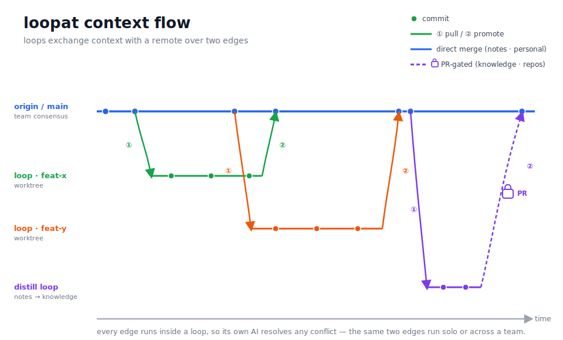

# context flow

> **A loop is a git worktree; the shared context is its `main`. Each loop
> *pulls* the consensus it starts from, and *promotes* the work worth sharing
> back into it — its own AI resolving any conflict along the way.** If you know
> `git`, you already know the model.

<p align="center">
  
</p>

Context accumulates in many places at once — working notes, distilled knowledge,
personal memory, code. Loopat keeps each in a plain git repo and lets a loop
work directly against it: pull what you start from, promote what's worth sharing.
The loop, with its AI, is the only moving part.

This is the **horizontal** companion to [`architecture.md`](architecture.md),
which covers the **vertical** axis — *distillation*, how context condenses upward
(`workdir → notes → knowledge`). Distillation promotes *across layers*; flow
aligns *one layer across places*.

---

## Mental model in one line

A **loop is a local directory** — a bundle of git **worktrees**, each tracking
its own remote over two edges:

| Edge | Direction | Driven by | When |
|---|---|---|---|
| **① pull** | remote → loop | the runtime | once, at loop creation |
| **② promote** | loop → remote | the loop's AI | when work is worth sharing |

---

## The two edges

### ① pull — start from consensus

At creation the loop opens its worktree from `origin/main`:

```sh
git fetch origin
git worktree add loops/<id>/context/notes -b loop/<id> origin/main
```

After that the loop is **isolated** — it does not keep pulling. (Pulling
mid-loop is always possible by hand; it just isn't automatic.)

### ② promote — share what's worth keeping

Promoting is not a plain push: to land on `main` you first reconcile with
where `main` is now. So promote **inherently absorbs everyone else's latest** —
that's the one moment a loop takes in others' work, and it's by design.

```sh
git fetch origin
git merge origin/main       # conflicts → the loop's AI resolves them
git push origin HEAD:main   # ungated: straight into consensus
```

Promote is **deliberate** — the loop's AI decides *when* work is worth sharing,
not every turn. When a context is **gated**, promote opens a PR instead:

```sh
git push origin HEAD:refs/heads/loop/<id>
gh pr create --base main --head loop/<id>   # gated: review, then merge
```

---

## Every write happens inside a loop

> **There is no write path to a remote outside a loop.**

Because every write lives in a loop, the loop's own AI is always on hand to
resolve a conflict. Three consequences:

- **Want to sync? Open a loop** — there is nothing else to run, and it doubles
  as the escape hatch for anything tricky.
- **A device not running a loop simply isn't current**; the next loop's ① pull
  catches it up.
- **Going solo → team is itself a promote** — attach a remote, open a loop, and
  it does `fetch → merge → push`. No migration step.

---

## A loop is a worktree, not a pushed branch

`loop/<id>` is a **worktree-local ref** (git worktrees must sit on some ref) —
the git carrier of "a loop is a directory," not a unit of sync:

- **ungated** (notes · personal) — promote pushes `HEAD:main` and leaves no
  branch behind; the ref dies with the loop.
- **gated** (knowledge · repos) — the branch is pushed as a PR's source.

Many loops on a device share one object store via worktrees — N loops are N
checkouts, not N clones (add `--filter=blob:none` to keep even that lean).

---

## The four kinds of context

Same skeleton everywhere — per-loop worktree, ① pull / ② promote, conflicts
resolved by the loop's AI. They differ only in **which remote**, **who writes**,
and **how**. The **gate is an optional modifier on promote**, not a fixed trait.

| | **notes** | **knowledge** | **personal** | **repos** |
|---|---|---|---|---|
| **remote** | team origin | team origin | your private remote | each repo's remote |
| **who writes** | any loop | a distill loop | only you | any loop (own `workdir`) |
| **how** | ad-hoc capture | explicit *distill* | ad-hoc | work product |
| **in the loop** | worktree (rw) | worktree (ro to others) | worktree (rw) | worktree (rw) |
| **gate** | default none | add-able | default none | add-able |

- **notes** — anyone records what's worth keeping; merges into consensus freely.
- **knowledge** — only a **distill loop** (its `knowledge` worktree writable)
  reads notes, distills, and promotes. Curated and slow; read-only to all others.
- **personal** — *notes wired to a private remote.* Same shape, just yours.
- **repos** — *notes with a gate, on each repo's remote.* `workdir` is a loop's
  checkout; promote merges its branch back (`workdir → repos`).

The principle: **the more shared and important a layer is, the slower it flows
and the higher its gate.** *Read down, write up — slowly.*

---

## Conflicts

A graceful chain; a human is never required:

1. **Structure first (no AI, ~99%).** One-file-per-item + index, per-author /
   per-loop directories, append-only surfaces → different writers, different
   files → git auto-merges. This is what keeps everything else cheap at scale.
2. **The loop's AI.** A real same-spot conflict is a three-way merge by the
   loop's AI — always a **merge, never a rebase**, so a bad merge stays
   revertible.
3. **You, if you want.** Open a loop and resolve it together.

Concurrent promotes serialize naturally: git rejects the losing push, that loop
`fetch → merge → push`es again.

---

## Solo and team are one mechanism

The remote is **optional**, so it's one model at every scale:

- **solo** — no remote; the edges run against a purely local `main`.
- **team** — attach the remote; the same edges run, with everyone converging on
  it.

*Works solo, scales to teams* — at the context layer, not two systems but one.

---

## Where to look next

- [`architecture.md`](architecture.md) — distillation, read/write paths, sandbox
  & vault model.
- [`composition.md`](composition.md) — how `.claude/` config tiers compose into
  a loop.
- [`context-flow.svg`](context-flow.svg) — the diagram on its own.
