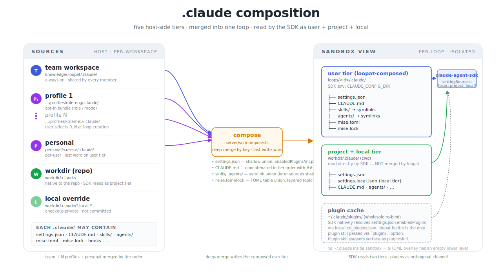

# .claude composition model

> 描述 loopat 如何为每个 loop 装配 `.claude/` 运行环境。
>
> 关于术语：你之前说的 "agent loop" 不准——loopat 这个名字本身就是 "loop"。
> 我们要描述的事是 **"loopat 怎么把多层 .claude 合成一个 loop 的运行环境"**。
> 简称用 **".claude composition"** 或 **"tiered claude config"**。

---

## 0. 一句话心智模型

> **Claude Code 自带 3 个 setting source（`user` · `project` · `local`）。
> loopat 在上面加了 2 个 team-side tier（`workspace` · `profile`），合并成
> CC 的 `user` tier 喂给 SDK。** 其他啥都不变。

---

## 1. 原则：CC-native，最低心智负担

**loopat 不发明 .claude 的目录结构、不重新定义文件格式、不引入 loopat 专属语义。** 你
在 CC 文档里看到的 `.claude/` 行为，在 loopat 里就是同款行为；你在 CC 文档里看到
的 `settings.json` 字段，在 loopat 里就是同样起作用。

唯一的"额外动作"是：**team / profile 这两个新 tier 在 SDK 启动前先被 loopat 合并
进 user tier**。合并后产物长成完全标准的 `.claude/` 形状，SDK 一看就懂——它根本
不知道 loopat 存在。

由此推论一些 loopat 上手时的对齐预期：
- `.claude/settings.json` 的所有 CC 字段都生效（包括我们没显式列出的）
- 任何 CC 后续给 `.claude/` 加的新功能，loopat 都自动兼容
- 学过 CC 的人不用学第二遍

---

## 2. SDK 与 .claude 的关系（纠正一个常见误解）

**Claude Agent SDK 完全识别 `.claude/` 目录。** 它就是 CC 引擎的 wrapper——CC CLI
认的 `.claude/`，SDK 也认。两个唯一区别：

1. **CC CLI 默认从 `~/.claude/` 读 user tier；SDK 允许 `CLAUDE_CONFIG_DIR` env 改这个根**——loopat 就是利用这点把 user tier 指向 `loops/<id>/.claude/`。
2. **SDK 有个 isolation 模式**：传 `settingSources: []` 完全不读文件系统。loopat **不用**这个模式，loopat 传 `["user", "project", "local"]` 让 SDK 全读。

所以分工是：

| 谁 | 干什么 |
|---|---|
| **loopat** | 把 team workspace / N profiles / personal 三层的 `.claude/` 合并写到 `loops/<id>/.claude/`；把 `CLAUDE_CONFIG_DIR` 指向那里 |
| **SDK** | 启动时按 `settingSources` 自动扫 user / project / local 三层 `.claude/`，加载 settings.json / CLAUDE.md / skills/ / agents/，注册 hooks，连 MCP 等 |

**loopat 不是把内容"喂给" SDK——loopat 只是把 SDK 自己会读的那个目录预先布置好。**

### 例外：plugin / MCP 走 SDK option，bypass settings.json

`.claude/` 里的内容分两类，决定了 loopat 处理它们的方式：

| 类别 | 例子 | 内容存在哪 | settings.json 起的作用 |
|---|---|---|---|
| **A. 自包含** | skills/ · agents/ · CLAUDE.md · hook 脚本 | 就在 `.claude/` 里（或 settings.json 直接引用的本地路径） | SDK 读 settings 就够了 |
| **B. 间接引用** | plugins · MCP servers | 内容在 `.claude/` **外面** | settings.json 只是个**指针**，还需要 sandbox 里能找到真正的内容 |

**类别 A 在 loopat 里完美工作：** compose 合并的 `.claude/` 写进 loop 目录，SDK 通过 `CLAUDE_CONFIG_DIR` 读到 = 一切自动生效。

**类别 B 在 loopat sandbox 里直接走 settings.json 会失败：**

- **Plugin**：`enabledPlugins: {"foo@bar": true}` 是个指针，**真正的 plugin 文件**在 `~/.claude/plugins/cache/...`（host CC 的缓存）。SDK 要解析这个指针得读 `~/.claude/plugins/installed_plugins.json` 拿 installPath。但 sandbox 的 `$HOME` 是空 overlay——`~/.claude/` **不存在**，SDK 没法解析；就算解析了，installPath 是 host 路径，sandbox 也看不到。
- **MCP server**：settings.json 能写，但 loopat 要把 vault 凭据（`apiKey` 等）**runtime 注入** MCP server 的 env——静态 settings.json 表达不了。

所以这两个走 SDK option：

| Option | loopat 怎么用 | 解决了 settings.json 路线的什么问题 |
|---|---|---|
| `plugins: [{type:"local", path:"..."}]` | host 侧 `resolveLoopPlugins` 解析出绝对路径 + bwrap ro-bind 每个 plugin 路径进 sandbox | 绕开 sandbox 里 `~/.claude/plugins/installed_plugins.json` 不可达的死结 |
| `mcpServers: {...}` | host 侧把 vault 凭据 merge 进 mcpServer 配置后整体传 | settings.json 写不下 runtime-resolved 凭据 |

**注意：compose 仍然会合并 enabledPlugins / mcpServers 字段**——但合并结果是给 `resolveLoopPlugins` / `mergeMcpTokens` 用的"声明清单"，最终生效靠 SDK option，不是靠 SDK 自己读 settings.json 的那条路。

总结：**SDK 识别 .claude/ 的全部字段，但 sandbox 的隔离性让"指针型"字段的解析链断了；这两个字段我们绕过去走 option，本质是在补 sandbox 的能力，不是 SDK 不行**。

---

## 3. 扩展性：`.claude/` 里啥都能 tier

只要某个文件/目录是 "drop into .claude/ 就生效" 的形态，loopat 的 compose 就天然支持它的多层覆盖。

**典型例子：mise.toml**

mise 是 loopat 引入的 toolchain 层（不是 CC 原生），但因为我们把 `mise.toml` 放在每层 `.claude/` 里，它自然继承了同款 5-tier merge——team 可以钉版本、profile 可以加工具、personal 可以本地覆盖。

往后 CC 给 `.claude/` 加新字段（比如假想的 `.claude/output-styles/`、`.claude/statusline.json`）——loopat 不用改一行代码，merge 逻辑会自动把它们 union 进去。

**总规则：放在 `.claude/` 里的东西自动获得 multi-tier 能力**。要扩 loopat、要给团队加共享能力，第一选择就是用 CC native 的 `.claude/` 子项；只有 CC 完全没有的能力（比如把 host 路径绑进 sandbox）才需要在 loopat 自己的代码里加。

---

## 4. Tier merge 逻辑

### 5 个 source tier（按合并顺序）

| 顺序 | Tier | 路径 | 谁维护 |
|---|---|---|---|
| 1 | team workspace | `knowledge/.loopat/.claude/` | 团队管理员，全员共享 |
| 2 | profile-1 | `knowledge/.loopat/profiles/<name>/.claude/` | role/mode 子团队 |
| ⋮ | profile-N | 同上 | 用户在 NewLoop 时选 0..N 个 |
| 3 | personal | `personal/<user>/.claude/` | 每个成员自己 |
| 4 | workdir (repo) | `workdir/.claude/` | **不被 loopat merge**——SDK 直接读 |
| 5 | local override | `workdir/.claude/*.local.*` | **不被 loopat merge**——SDK 直接读 |

前 3 层（team + profiles + personal）会被 loopat compose 合并成一个目录写到 `loops/<id>/.claude/`，这就是 CC 的 `user` tier。后 2 层（workdir + local）由 SDK 自己读 cwd-relative 的 `.claude/`，loopat 不动它们。

### 合并规则（每种内容不同）

| 内容 | 规则 |
|---|---|
| `settings.json` | 按 key shallow union；`enabledPlugins` / `mcpServers` / `extraKnownMarketplaces` 按子 key last-wins |
| `CLAUDE.md` | 按 tier 顺序拼接，每段加 `## <tier-name>` 头 |
| `skills/<name>/` | symlink union，同名后写者赢 |
| `agents/<name>.md` | symlink union，同名后写者赢 |
| `mise.toml`, `mise.lock` | TOML table-level union（`[tools]` / `[env]` 各自 union） |

实现锚点：`server/src/compose.ts`（45 个单元测试覆盖在 `server/test/compose.test.ts`）。

### 图示

---

## 5. 最终 Sandbox 里有几个 SoT？

**两个。** 这是 CC 设计上就有的——user tier + project tier 本就并存（local 算 project 的同层 override）。

| Sandbox 里 | 对应路径 | 谁喂 | 内容 |
|---|---|---|---|
| user tier | `$CLAUDE_CONFIG_DIR/` → `loops/<id>/.claude/` | loopat compose 合成 | team+profile+personal 的并集 |
| project tier | `$CWD/.claude/` → `workdir/.claude/` | repo 自己自带 | 跟着 repo 走，loopat 不碰 |
| local tier | 同 cwd 下的 `*.local.*` 文件 | 同上 | repo checkout-private 私货 |
| ~~user tier (host)~~ | ~~`~/.claude/`~~ | **没有** | sandbox $HOME 是个空 overlay |

第三条尤其重要：**sandbox 里不存在 host 的 `~/.claude/`**——bwrap 把 $HOME 挂成 overlayfs，lower 层（`sandbox-home-skel/`）是空的，所以 host CC 本机配置（你自己 `claude plugin enable` 的、自己写的 CLAUDE.md 等）一概看不到。loopat 这么设计是有意的：要可复现，host 的 ad-hoc 状态不能漏进 loop。

所以一个 loop 看到的"运行环境"就是 **(loopat 合成的 user tier) ∪ (repo 自带的 project/local tier)**，仅此而已。

---

## 6. `.claude/` 里可以被层叠的东西

下面这些都是放到 `.claude/` 子项就会被 loopat 自动多层合并的：

### CC native

- **`settings.json`** — 主配置文件。CC 所有顶层 setting 字段都在这（包括 `enabledPlugins` / `mcpServers` / `extraKnownMarketplaces` / `hooks` / `model` / `permissions` / 等）
- **`CLAUDE.md`** — 团队 always-on doctrine
- **`skills/<name>/SKILL.md`** — 用户主动调用的 procedure（`/skill-name`）
- **`agents/<name>.md`** — 主 agent 派活给 subagent 的 prompt 定义
- **`hooks/`** — 通过 settings.json 的 `hooks` 字段引用的脚本
- **MCP servers** — 写在 `settings.json` 的 `mcpServers` 字段（也可以走 `extraKnownMarketplaces` 用 plugin 形式分发）

### CC native，loopat **绕过 settings.json** 用 SDK option 传的

- **plugins**（`enabledPlugins` 字段）—— compose 会合并 enabledPlugins，但实际加载靠 `resolveLoopPlugins` 把绝对路径数组喂给 SDK option，原因见 §2
- **mcpServers** —— 合并的 mcpServers 会被 vault 凭据注入后通过 SDK option 传，原因同上

### loopat 引入的扩展

- **`mise.toml` / `mise.lock`** — 工具链版本钉死，per-loop activate

### 待加（CC 后续如果加新字段，自动跟）

- 任何 CC 后续往 `.claude/` 加的子项——`.claude/output-styles/`、`.claude/statusline.json`、等等——只要写到 `compose.ts` 的合并规则里（通常 10 行内能搞定），就自动获得 5-tier 层叠能力

---

## 7. 每个能力的细节对照表

下表横向：六个具体能力（skill / agent / MCP / plugin / hook / mise）。
纵向：5 个维度——它是什么 · 在 .claude 放哪 · CC 怎么启用 · SDK 怎么启用 · loopat 怎么启用 · sandbox 里落在哪。

| 维度 | **Skill** | **Agent (subagent)** | **MCP server** | **Plugin** | **Hook** | **Mise toolchain** |
|---|---|---|---|---|---|---|
| **是什么 / 何时用** | 一段用户可主动调用的 procedure（`/foo`）。流程稳定 + 想显式触发时用 | 一个可被主 agent 派活的子 agent（独立 system prompt + tool 限制 + 模型选择）。需要主 agent 把一段任务委托出去时用 | 暴露外部工具（jira / github / slack / 自研 MCP）给 CC 用的进程 | 一个能力包：把 skills + agents + MCP + hooks 打成一个可分发单元（带 marketplace 元数据） | 在特定事件触发的脚本：Setup / PreToolUse / PostToolUse / SubagentStop 等 | 工具链版本钉死（node/python/uv/…）；loopat 引入，CC native 不识别 |
| **放在 .claude 哪里** | `.claude/skills/<name>/SKILL.md`（必带），可加附件 | `.claude/agents/<name>.md`（单文件，frontmatter + body） | `.claude/settings.json` 的 `mcpServers` 字段（不是文件） | 不直接放——通过 `.claude/settings.json` 的 `enabledPlugins` + `extraKnownMarketplaces` 引用；plugin 内容存在 `~/.claude/plugins/...` host 缓存 | `.claude/settings.json` 的 `hooks` 字段（指向脚本路径） | `.claude/mise.toml`（pin）+ `.claude/mise.lock`（lock） |
| **CC 里怎么启用** | drop in `.claude/skills/<name>/` 就生效——无 enable 字段，目录在 = 可用 | drop in `.claude/agents/<name>.md` 就生效——同样无 enable 字段 | 在 `settings.json` 写 `mcpServers.<n>: {...}` 就生效 | 必须显式 `enabledPlugins["foo@market"]: true`——dropin 缓存不算（详见 [CC plugins 文档](https://docs.claude.com/en/docs/claude-code/plugins)） | 在 `settings.json` 写 `hooks.<event>: [...]` 就生效 | n/a（CC 不识别） |
| **SDK 里 query() 时怎么启用** | `settingSources` 含 `'user'`（扫 user tier）+ `'project'`（扫 cwd）；可选 `skills: 'all' \| string[]` 过滤；目录里有就会被发现 | `settingSources` 含 `'user'`/`'project'`/`'local'` 自动扫文件系统；或者通过 `agents:` option 程序化定义 | 三选一：① settings.json mcpServers（settingSources='user' 起作用）② `mcpServers:` option 直接传（loopat 走这条）③ plugin 携带的 `.mcp.json` | settings.json 里的 enabledPlugins 通过 settingSources 生效；或 `plugins:` option 直接传 `[{type:"local", path:...}]`（loopat 走这条，bypass settings） | settings.json 的 hooks 通过 settingSources 生效；或 `hooks:` option 程序化定义 | n/a |
| **loopat 里怎么启用** | 在某层 `.claude/skills/` 放进去——compose 把它符号链接进 user tier。在 NewLoopDialog 选对应 profile / 写到 team workspace / 放 personal 都行 | 同 skill：放到某层 `.claude/agents/` 就自动可用 | 在某层 `.claude/settings.json` 的 `mcpServers` 写——compose merge 后由 SDK option 注入（顺带把 vault 凭据并进去） | 在某层 `.claude/settings.json` 的 `enabledPlugins` 写 `true`——compose merge 后 `resolveLoopPlugins` 解析路径，bwrap ro-bind 进 sandbox，SDK option 喂 | 在某层 `.claude/settings.json` 的 `hooks` 写——通过 settingSources `'user'` 生效 | 在某层 `.claude/mise.toml` 写——bwrap 启动前 `mise install + env --json`，把 PATH/env 注入 sandbox |
| **Sandbox 里落地路径** | `loops/<id>/.claude/skills/<name>/` (symlink → 源 host 路径) | `loops/<id>/.claude/agents/<name>.md` (symlink → 源 host 路径) | 不落文件——通过 SDK 进程内部传递 | 不在 `.claude/plugins/` 里——每个 plugin 通过 `--ro-bind <host-path> <host-path>` 单独可见，CC 在 `--plugin-dir` 拿到 | `loops/<id>/.claude/settings.json` 的 `hooks` 字段；脚本本身在源 tier 的 host 路径上（被知识 repo bind 或 personal bind 覆盖） | `loops/<id>/.claude/mise.toml` + bwrap `--setenv` 把 PATH 注入 |

---

## 8. 实施位置（代码索引）

| 关注点 | 文件 |
|---|---|
| Tier 解析（team + profile + personal + repo） | `server/src/profiles.ts` |
| 多层 merge（写出 loops/<id>/.claude/） | `server/src/compose.ts` |
| Plugin 解析 + 路径缓存 | `server/src/plugin-installer.ts` |
| bwrap 绑定（含 plugin / personal 路径可见性） | `server/src/bwrap.ts` |
| SDK options（settingSources / plugins / mcpServers） | `server/src/session.ts` |
| compose 单元测试 | `server/test/compose.test.ts` |
| bwrap 可见性回归测试 | `server/test/bwrap.test.ts` |

---

## 9. 跟早期设计稿的差异

更早的 `composition-model.md`（design rationale 版本）里写过 `profile.json` 三字段 schema + sibling `CLAUDE.md`。后来实测发现：

- 用 CC-native 的 `.claude/` 目录形态，可以让 profile **自己就是个 mini-workspace**——profile 自带 settings.json/skills/agents/CLAUDE.md/mise.toml，全部能层叠
- 不需要 `profile.json` 这个 loopat 专属 schema
- profile 的"声明 plugin 依赖"自然由 profile 自带的 `.claude/settings.json` 的 `enabledPlugins` 承担

所以本文档描述的形态 = `.claude/` 一通到底，**profile 不是新 schema 而是新 tier**——这是相比早期设计稿最大的演化。当前的 `server/src/profiles.ts` 实现就是这版。

---

## 10. 一句话总结

> **CC 自带 user/project/local 三 tier。loopat 加 workspace/profile 两 tier，
> 全部按 CC 的 `.claude/` 形态摆放，由 compose.ts 合并成一个 loop 的 user tier
> 喂给 SDK。SDK 完全识别这套——loopat 不发明任何新格式。**
