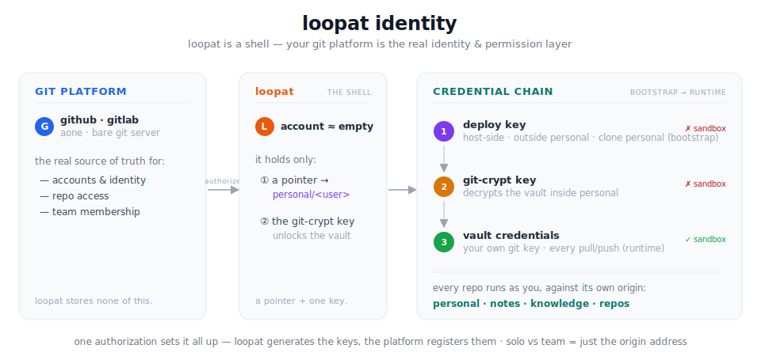

# identity

> **loopat stores no accounts and no permissions.** Your **git platform** is the
> identity and authorization layer; loopat is a shell that acts with your git
> identity. A loopat account is almost empty — it only **points at your
> `personal/<user>` repo** and **holds the one key that unlocks it**. Everything
> else — who you are, what you may read or write — already lives in git.

<p align="center">
  
</p>

Most tools build their own user system: accounts, roles, permission tables.
loopat builds none of that. Identity, membership, and access already exist — in
the git platform your team already uses. loopat **integrates into that platform**
so that, at registration, a single authorization (an OAuth grant, or one token)
lets loopat set everything up *for* the user. The user never does fiddly git
plumbing, and the only thing they must understand is something they already
have: **their git account.**

This is the identity companion to [`context-flow.md`](context-flow.md):
context-flow describes *how context moves* between a loop and its remotes; this
doc describes *who the loop acts as* when it does, *what unlocks* that identity,
and *how loopat integrates with the git host* to set it all up automatically.

---

# Part 1 — the identity model

## A loopat account is almost empty

Strip a loopat account down and only two things remain:

1. **a pointer** — which `personal/<user>` repo is yours, and
2. **the git-crypt key** — the one secret that decrypts that repo's vault.

There is no password-protected profile, no permission matrix, no credential
store of loopat's own. Your real identity (a git account) and your real
credentials (inside your own repo) live in git; the loopat account is just a
pointer plus an unlock key.

## The credential chain — three things, one line

```
  deploy key  ──►  git-crypt key  ──►  vault credentials  ──►  every git op
  (bootstrap)      (decrypt)           (your own git key)      (pull / push)

  clone personal   open the vault      run as you            personal · notes ·
  the first time   inside personal      thereafter            knowledge · repos
```

| thing | where it lives | what it does | in the sandbox? |
|---|---|---|---|
| **deploy key** | host-side, **outside** `personal/` | `git clone` the personal repo — **bootstrap only** | no |
| **git-crypt key** | on the host today (see below) | decrypt the git-crypt'd **vault** inside `personal/` | no |
| **vault credentials** | inside `personal/`, git-crypt'd | **every runtime pull/push**, for every repo | yes (decrypted) |

The deploy key pulls `personal/` down → the git-crypt key opens its vault → the
vault's credentials run all the git from then on. Three links, each one job.

## Runtime is symmetric — everything uses the vault

Once the chain has run, there is no special case. Every repo — `personal`,
`notes`, `knowledge`, every code repo — is pulled and pushed in the loop with
**the same vault credentials** (your own git key), against its own `origin`:

- **personal is not an exception.** Its vault credentials push its own `origin`
  like any other repo — not self-reference at runtime, because by then
  `personal/` is already on disk and decrypted.
- **solo vs team is just the `origin` address** — a local repo path or a remote
  team server. Same key, same commands, no mechanism difference.

The loop acts **as you**, so git authorship is honest and access is your own
membership on each repo — granted and revoked in the git platform, per person,
with no shared master credential.

## Bootstrap vs runtime — no chicken-and-egg

The vault holds the credentials, but the vault lives *inside* `personal/`. The
first time, that loops: to read the credentials you need the repo, but to fetch
the repo you'd need a credential. It's broken by the **one key that lives
outside the box it opens** — the deploy key, kept host-side, never in
`personal/`. Its sole job is the first `git clone personal`; after that the vault
is in hand and the deploy key steps aside. Such a bootstrap secret is unavoidable
for any "no database, data in the user's own repo" design.

## The git-crypt key: on the host today, one-shot tomorrow

- **today (simple):** kept on the host, so loops just work.
- **tomorrow (secure):** the user supplies it **once, at loop creation** — loopat
  decrypts and **forgets**, never persisting it at rest.

Only the key's residency moves; the rest of the model is identical.

---

# Part 2 — integrating with a git host

Everything above assumes the per-user pieces already exist: a personal repo, a
deploy key on it, a runtime key the user's account trusts, and membership on the
team repos. **Integration is loopat doing all of that for the user**, driven by a
single authorization at registration. The model is platform-agnostic; what
differs per platform is only *how* each step is performed.

## The integration contract

To onboard a user, loopat needs the host to support five operations. Any platform
that offers these can be a loopat backend:

| # | capability | loopat uses it to … |
|---|---|---|
| 1 | **authenticate a user** | turn a one-time OAuth grant / token into "this is user X" |
| 2 | **create a repo** in the user's namespace | make the private `personal/<user>` repo |
| 3 | **register a deploy key** on a repo | put loopat's **deploy key** on `personal` for bootstrap clone |
| 4 | **register an account key** for the user | trust loopat's generated **runtime key** so the loop can reach every repo the user may | 
| 5 | **grant a member access** to a repo | add the user to `knowledge` / `notes` / project repos (usually admin-gated) |

**Key generation is loopat's, registration is the platform's.** loopat generates
two ed25519 keypairs per user and registers the *public* halves through the
platform; the private halves go to their two homes from the chain:

- a **deploy key** → registered on the `personal` repo (read) → private half
  host-side (`host-secrets/<user>/`), for bootstrap.
- a **runtime key** → registered on the user's account (or as a deploy key on
  each repo) → private half written into the **vault** (git-crypt'd inside
  `personal/`), for all runtime git.

So "how does the user's key get generated?" — loopat generates it; the
authorization just lets loopat *register* it. The user pastes nothing.

## Example A — self-hosted git

Two shapes, depending on whether the self-hosted host has an API:

- **A managed self-host (e.g. self-run GitLab):** it has a REST API and the same
  five capabilities as a SaaS — integrate exactly like GitHub below, just against
  your own URL and an admin/owner token.
- **A bare git server (sshd + bare repos, no API):** there's no "API", so the five
  capabilities map to **server-side admin over ssh**:
  - *create repo* → `git init --bare /srv/git/<...>.git` (personal, knowledge, …)
  - *register key / grant access* → append the public key to the right
    `~/.ssh/authorized_keys` (or a gitolite/`authorized_keys` rule) — on a bare
    server, "a key" and "access" are the same thing.
  - *authenticate* → there's no OAuth; the admin registers users out-of-band.

  loopat reaches the server with an **admin ssh credential** to run these, and
  every user's runtime key is just another `authorized_keys` entry. Minimal, and
  proof the model needs nothing fancy.

## Example B — GitHub

- **authenticate** → a **GitHub OAuth App**: the user clicks "Authorize", loopat
  receives a scoped token (or the user pastes a PAT). This token does onboarding
  chores and is **never** the runtime credential — it stays host-side.
- **create personal repo** → `POST /user/repos` (private).
- **deploy key** → `POST /repos/{owner}/personal/keys` (read-only).
- **runtime key** → `POST /user/keys` (account-level → reaches every repo the user
  may), private half → vault.
- **grant team access** → `PUT /repos/{org}/{repo}/collaborators/{user}` — needs
  admin on the team repos, so this step runs with an **org-admin** token at
  team-setup time, not the user's own token.

## Example C — an internal platform

An internal platform (internal-git, an in-house Gitee, etc.) is a loopat backend the
moment it can satisfy the five-capability contract. To integrate one, wire up:

- **an OAuth app / SSO** so loopat can authenticate users (capability 1);
- **API endpoints** (or equivalent CLI/automation) for create-repo, register-key,
  and add-member (capabilities 2–5);
- **an admin identity** loopat uses for the admin-gated step (5) — granting team
  members access to `knowledge`/`notes`;
- **the base URL + auth scheme** in loopat's workspace config.

There is nothing platform-specific in loopat's core — adding a new backend is
writing a small adapter that maps these five operations onto that platform's API.

---

# Security boundary

- **What a loop sees:** the decrypted **vault credentials** — a key that can only
  *read and write git* on the repos your account already reaches.
- **What a loop never sees:** the **onboarding/admin token** (which could create or
  delete repos and change permissions) and — in the secure mode — the
  **git-crypt key** at rest. Account-shaping actions stay outside the loop.
- **Revocation:** the deploy key, the runtime key, and the granted memberships are
  ordinary git-platform entries — revoke any of them, independently.

---

# Relationship to context-flow

| | [`context-flow.md`](context-flow.md) | this doc |
|---|---|---|
| answers | **how** context moves (① pull / ② promote) | **who** the loop acts as, what unlocks it, how it's set up |
| unit | the edge between loop and `origin` | the credential chain behind every edge |

Together: a loop **pulls and promotes** context (context-flow) **as you, with
your own git credentials** (identity), set up by loopat **integrating with your
git host** — while loopat itself holds almost nothing.
